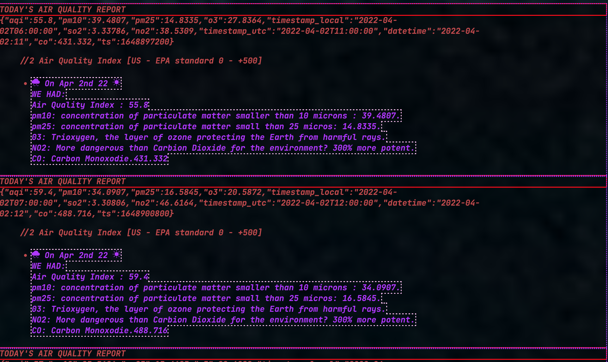
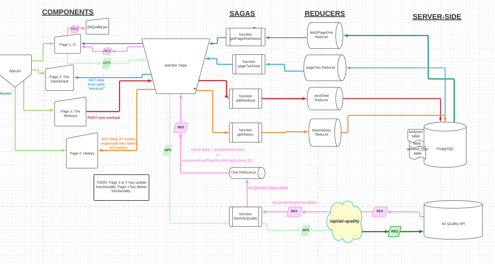
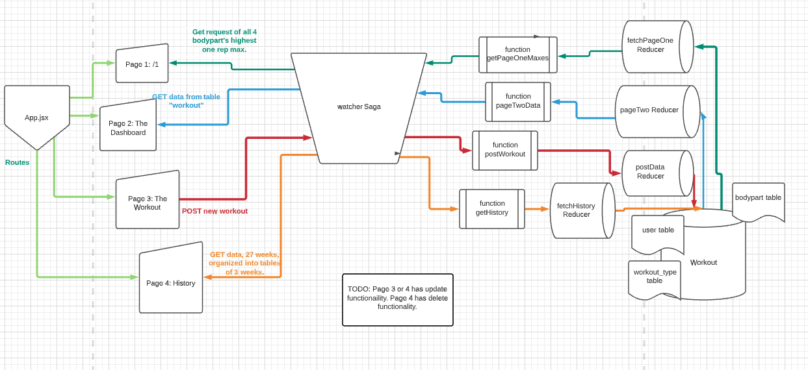
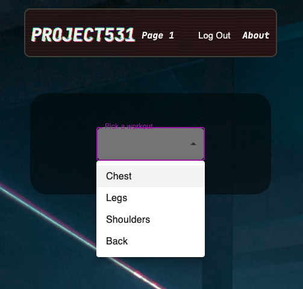
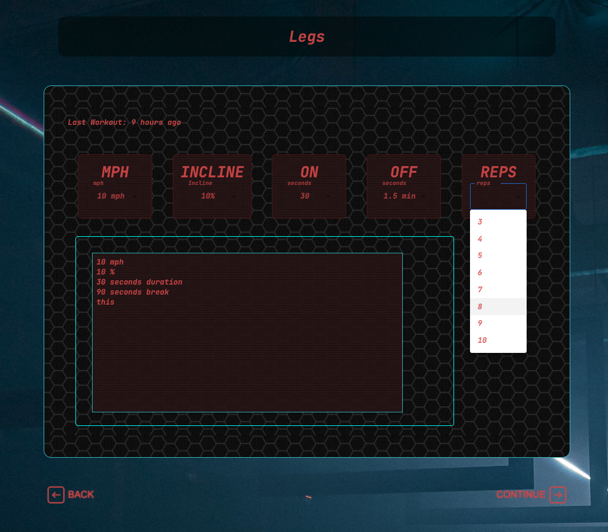
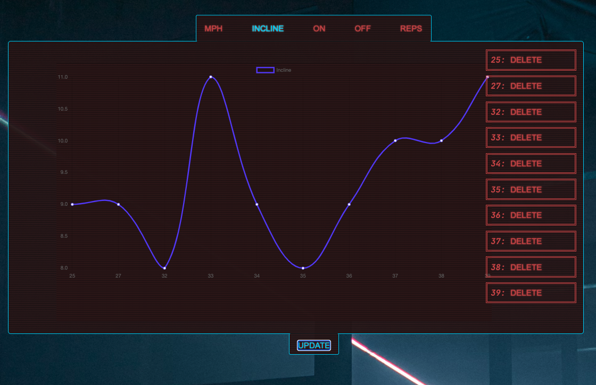
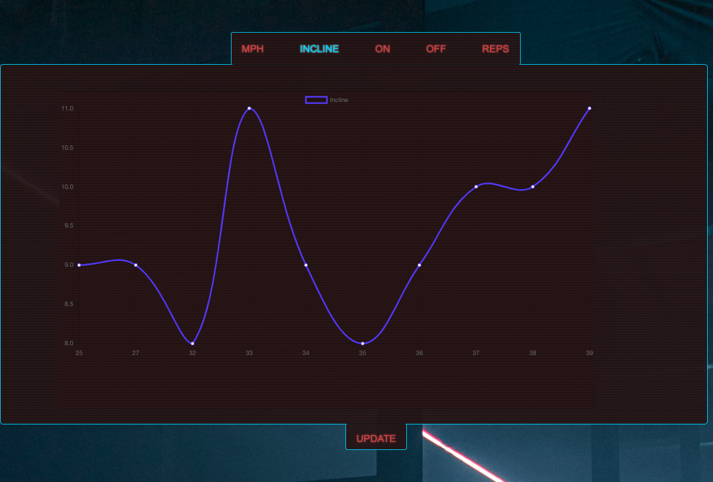

 *Design inspired by the popular RTS game Starcraft and, to a lesser extent, Cyberpunk 2077.*

### A workout app for the popular workout template, [Jim Wendler's 5/3/1](https://www.jimwendler.com/collections/books-programs/products/5-3-1-second-edition-hard-copy) !
---
### Sprint duration  

- Part 1: 2 weeks.
- Part 2: 5 days.
- Part 3: April 1st - 5th 2022
---

### Prerequisites  

- Internet browser (e.g. Chrome, Firefox, Safari) 
- Chart.js 
- Node.js 
- PostgreSQL 

---

### Installation
---
Create a database using the provided .sql file (title the DB <b>`project_531`</b>)
- Run the queries in the included `database.sql` file
- Run `npm install` from the project root directory
- Run `npm run server` to run the node server
- In a separate terminal tab, run `npm run client` to launch the React app

---

### Start Here.
 Let me start with Part 3, since it's the newest! 

---
# Sprint 3
### Step 1. Project Planning
#### Design:
#### Research:

##### But what do these numbers mean??
Looks like some research about Air Quality measurements is in order. For those curious, I found out more at [EPA Air Quality Index](https://www.epa.gov/pmcourse/patient-exposure-and-air-quality-index#what)

> *The AQI is a nationally uniform color-coded index for reporting and forecasting daily air quality. It is used to report on the most common ambient air pollutants that are regulated under the Clean Air Act: ground-level ozone, particle pollution (PM10 and PM2.5), carbon monoxide (CO), nitrogen dioxide (NO2), and sulfur dioxide (SO2). The AQI tells the public how clean or polluted the air is and how to avoid health effects associated with poor air quality.

The AQI focuses on health effects that may be experienced within a few hours or days after breathing polluted air and uses a normalized scale from 0 to 500; the higher the AQI value, the greater the level of pollution and the greater the health concern. An AQI value of 100 generally corresponds to the level of the short-term National Ambient Air Quality Standard for the pollutant. AQI values at and below 100 are generally considered to be satisfactory. When AQI values are above 100, air quality is considered to be unhealthy, at first for members of populations at greatest risk of a health effect, then for the entire population as AQI values get higher (greater than 150).*

 

### Step 2. Updating wireframe using [Lucidchart](https://www.lucidchart.com/pages/)
- A user inputs their coordinates (GPS, in our case, hardcoded to White Bear lake, MN).
- GPS is placed inside the body of request, headers are added and api request is made to Rapid Api (REQ).
- The return path is pink, I began to write down what the data will be called as it is passed along to the next functional component.

---
# Sprint 1
### Step 1. Design

 

### Step 2. Datapath using [Lucidchart](https://www.lucidchart.com/pages/)

- This was the original concept schematic for how the data would flow behind the scenes.  I was confident I had all the data routes figured out, and was impressed by how wrong I actually was. As of writing, there are twice as many GET, POST, and DELETE routes as originally planned (and more are coming.) This is forgiveable on such a small, linear solo project; I would find it invaluable to do multiple iterations in group projects to keep everyone on the same page and speaking the same language.

### Final
 - <b>Page 1 - Choose a workout! This variation of 5/3/1 has 4 options (4 bodyparts, each trained once a week)</b>

 - <b>Page 2 - User sees his/her last workout, the week they are in the cycle, and the date they worked out the bodypart last. (for this example, lets imagine it the one rep max was 150lbs in week 1.)</b>

 - <b>Page 3 - User inputs the data of the next workout; 150 lbs for week 2. The workout generates and they are able to update a new PR. I discovered it was more user-friendly to also have a delete workout button on this table as well.</b>

 - <b>Page 4 - History page. The user can see their past workouts for that bodypart. (Only 1 available workout for me so far, but many more to come!) Users can also delete workouts from this page.</b> 

---

---
# Sprint 2
### Step 1. Record your sprint
 

### Step 2. Sprint display.

 

### Step 3. Sprint display with update button off. 

 
---

### Tuesday & Wednesday:
- [x] Create routing for 1st page. ~4 hours
- [x] Create button for first page, that goes to first and second page (testing) ~2hr
- [x] Create a best guess of table, with testing values ~1.5hr
- [x] Create basic layout for second page. (Lots to improve upon in CSS, I think flexbox will work well but tonight has revealed how little I know about grid.) ~2 hr
- [x] Added signature to footer. ~10 mins
- [x] Base functionality of page three complete. ~4 hours.
- [x] Successfully push input values into useState. (This was a challenge.  New to switch statements and new to Material UI...In using Material UI for the dropdown menu, I ran into an unexpected issue with the syntax where grabbing the value's id was not immediately apparent.  As soon as I find out how to grab that value, the switch statement should also come together.) ~3 hours
- [x] Create and dispatch object data. (As of writing this, this involves updating the database with new values not included in the scope, but it is still early in the game and no time has been wasted.)

### Friday:
- [x] Posted the workouts added to the DOM.
- [x] Destructured the workout list into workout items
- [x] Append only the new workout.  ~14 hour day... lots of lessons learned!

### Saturday:
- [x] Create a table for the new workout
- [x] Edit functionality in new workout (I'm not sure if I should have 1 saga, or many, I'm going to do a combination of both -- the Edit/Delete will have their own saga, for practice sake.)
- [x] Properly linking all pages. Clearing inputs, adding an Edit button with addition and subtraction functionality.
- [x] Discovered and added Sweet Alerts. (All of Saturday and Sunday involved a great deal of practicing ternary operators and conditional rendering, ~7 hours on that alone over the 2 days.)

### Monday:
- [x] PUT req to server completed and tested.
- [x] Basic CSS layout for page 2s completed.
- [x] Data cursor on /user page... this may be much more complicated than it looks.
- [x] History page has data from last workouts
- [x] History page has a delete function
- [x] Link up the remaining 3 bodyparts to also be able to post a workout.

In the future:
- [] Deploy to Heroku.

# EDA Project
This version uses React, Redux, Express, Passport, and PostgreSQL (a full list of dependencies can be found in `package.json`).

## Deployment (Future goal.)

1. Create a new Heroku project
1. Link the Heroku project to the project GitHub Repo
1. Create an Heroku Postgres database
1. Connect to the Heroku Postgres database from Postico
1. Create the necessary tables
1. Add an environment variable for `SERVER_SESSION_SECRET` with a nice random string for security
1. In the deploy section, select manual deploy

